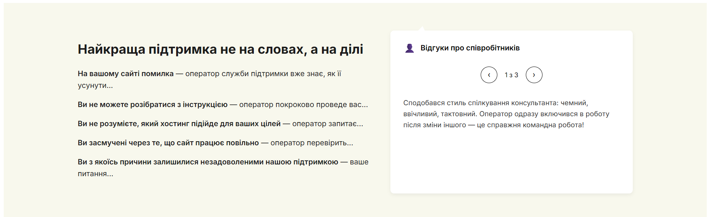

# Отзывы сотрудников — секция в стиле Hostiq

Этот небольшой проект реализует адаптивную секцию с **отзывами сотрудников**, вдохновлённую дизайном сайта [Hostiq.ua](https://hostiq.ua/).
В секции используется **Flexbox**, чистый **JavaScript** для слайдера и CSS-псевдоэлемент для создания фигурного “хвостика” в блоке отзыва — как у “бабблов” чатов.

---

## Демонстрация

> Секция состоит из двух частей:
>
> * **Левая колонка** — текст с описанием преимуществ поддержки.
> * **Правая колонка** — интерактивный слайдер с отзывами и навигацией.



---

## Технологии

* **HTML5** — структурная разметка секции.
* **CSS3 (Flexbox)** — вёрстка, стилизация и хвостик блока через `clip-path`.
* **Vanilla JS** — слайдер без библиотек.

---

## Структура

```
reviews-section/
│
├── index.html        # Основная HTML-страница с вёрсткой секции
├── style.css         # Стили для вёрстки, анимаций и хвостика
└── screenshot.png    # Превью внешнего вида секции
```

---

## Ключевые особенности

*  **Полностью адаптивная** (гибкий Flexbox, медиазапросы)
*  **Плавная анимация** переключения отзывов
*  **CSS-хвостик** с острыми краями, как у Hostiq
*  **Без внешних библиотек** (чистый JS)

---

## Логика слайдера

Слайдер реализован через изменение класса `.active`:

```js
function showReview(index) {
  reviews.forEach((r, i) => {
    r.classList.toggle('active', i === index);
  });
  counter.textContent = `${index + 1} из ${reviews.length}`;
}
```


